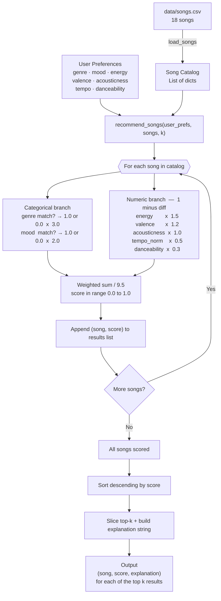
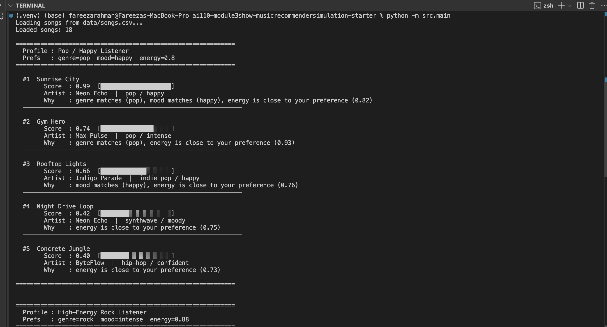

# 🎵 Music Recommender Simulation

## Project Summary

In this project you will build and explain a small music recommender system.

Your goal is to:

- Represent songs and a user "taste profile" as data
- Design a scoring rule that turns that data into recommendations
- Evaluate what your system gets right and wrong
- Reflect on how this mirrors real world AI recommenders

This simulation builds a content-based music recommender that scores songs by comparing their audio features directly against a user's stated preferences no listening history required. Each song is described by measurable attributes like energy, mood, and acousticness. Each user profile captures what they want from a listening session. The recommender computes a weighted proximity score for every song, ranks them, and returns the closest matches along with a plain-English explanation of why each song was chosen.

---

## How The System Works

Real-world platforms like Spotify and YouTube combine two strategies: **collaborative filtering** (finding patterns across millions of users — "people like you also liked X") and **content-based filtering** (analysing the audio DNA of a track — its tempo, energy, and mood — independent of any other listener). This simulation focuses entirely on the content-based side. Rather than asking "what do similar users play?", it asks "how closely does this song's measurable features match what this user asked for?" The system prioritises genre and mood as hard intent signals — a genre mismatch is treated as a near-failure regardless of how well the audio numbers align — then uses proximity scoring on numeric audio features to rank everything else. The result is a transparent, explainable recommender: every score can be traced back to specific feature comparisons.

---

### Song Features

Each `Song` object stores the following attributes:

| Feature | Type | What It Captures |
|---|---|---|
| `id` | int | Unique identifier |
| `title` | str | Song name |
| `artist` | str | Artist name |
| `genre` | str | Broad musical category (e.g. lofi, pop, rock, ambient) |
| `mood` | str | Intended emotional tone (e.g. chill, happy, intense, moody) |
| `energy` | float `[0-1]` | Perceptual intensity — loudness, pace, and drive |
| `tempo_bpm` | float | Beats per minute (normalized to `[0-1]` internally before scoring) |
| `valence` | float `[0-1]` | Musical positivity — bright and uplifting vs. dark and melancholic |
| `danceability` | float `[0-1]` | Rhythmic regularity and beat strength |
| `acousticness` | float `[0-1]` | Likelihood the track is acoustic rather than electronic |

---

### UserProfile Features

Each `UserProfile` stores the user's listening intent for a session:

| Field | Type | What It Represents |
|---|---|---|
| `favorite_genre` | str | The genre the user most wants to hear |
| `favorite_mood` | str | The emotional tone the user is in the mood for |
| `target_energy` | float `[0-1]` | How energetic the user wants the music to feel |
| `likes_acoustic` | bool | Whether the user prefers organic/acoustic production (`True` targets acousticness near 0.85, `False` targets near 0.15) |

---

### Scoring Logic

The recommender computes a **weighted proximity score** for every song and returns the top-k results sorted highest to lowest.

```
score = (
    3.0 x genre_match           <- 1 if genre matches, 0 if not
  + 2.0 x mood_match            <- 1 if mood matches, 0 if not
  + 1.5 x (1 - |song_energy      - user_energy|)
  + 1.2 x (1 - |song_valence     - 0.5|)         <- neutral default
  + 1.0 x (1 - |song_acousticness - target|)
  + 0.5 x (1 - |song_tempo_norm  - 0.5|)         <- neutral default
  + 0.3 x (1 - |song_danceability - 0.5|)        <- neutral default
) / 9.5
```

The `1 - |difference|` pattern is the key design choice: it rewards songs that are **close to the user's preference**, not songs that simply have a high or low value for a feature. A song with `energy = 0.42` scores nearly perfectly for a user who wants `energy = 0.40`, while a song with `energy = 0.95` scores poorly for that same user even though it has "more" energy.

---

### Data Flow

The diagram below traces a single song from the CSV file through the scoring loop to the final ranked output. Each node maps directly to a function or step in `src/recommender.py`.



---

### Algorithm Recipe

The recipe is a named set of rules the system applies in order. Understanding each rule makes it possible to predict — and critique — what the system will do in any situation.

**Rule 1 — Genre is the hardest gate**
Genre is the only feature with a weight of `3.0`. A genre mismatch alone costs more than any single numeric feature can recover. This means the system will almost always rank a mediocre song in the right genre above a great song in the wrong genre. This is a deliberate design choice, not an oversight: recommending a rock song to a lofi listener is a failure mode, not a near-miss.

**Rule 2 — Mood ranks second and captures session intent**
Mood is weighted `2.0` because it reflects what the user wants from *this* listening session, not just their long-term taste. A genre match without a mood match (e.g. lofi but energetic rather than chill) should still score meaningfully lower than a full match. Mood and genre together account for `5.0` out of `9.5` total weight — more than half the score.

**Rule 3 — Closeness beats magnitude for every numeric feature**
The formula `1 − |song_value − user_value|` is applied to all five numeric features. A song is not rewarded for being high-energy or acoustic in absolute terms — only for being *close to what the user asked for*. A user who wants `energy = 0.40` should not receive a song with `energy = 0.95` simply because it has "more" energy.

**Rule 4 — Unspecified preferences are scored neutrally**
If a user does not supply a value for valence, tempo, or danceability, those features default to `0.5`. The proximity formula then returns `1 − |song_value − 0.5|`, which rewards songs near the middle of the range and penalises extremes equally. This prevents unspecified features from accidentally biasing results toward the high or low end.

**Rule 5 — Every score is normalized to the same scale**
The weighted sum is always divided by the total weight (`9.5`), so every final score falls in `[0.0, 1.0]` regardless of how many features the user specified. This makes scores comparable across different profiles and catalog sizes.

---

### Expected Biases

These are known limitations baked into the current design. They are predictable, not accidental.

**Genre dominance bias**
Because genre carries weight `3.0`, a song in the wrong genre can almost never outscore a song in the correct genre — even if every audio feature is a near-perfect match. A classical piano track that is exactly the right energy and valence for a user still loses to a mediocre lofi loop if the user asked for lofi. In a real system this would suppress cross-genre discovery and create genre echo chambers over time.

**Catalog coverage bias**
The dataset has three lofi songs, two pop songs, and one of everything else. A lofi listener benefits from fine-grained score separation between *Library Rain*, *Midnight Coding*, and *Focus Flow*. A reggae listener has only one song that can ever score a genre match. The quality of recommendations is unequal across genres purely because of how the catalog was assembled.

**Neutral default bias**
Any feature not in the user profile defaults to `0.5`. Songs with valence, tempo, and danceability values near `0.5` receive a quiet passive boost on those features compared to songs at the extremes — even when those extreme-value songs might genuinely suit the user. A user who forgot to specify `valence` will be slightly steered away from very bright (valence = 0.9) and very dark (valence = 0.1) songs with no stated reason.

**Collinearity between energy and acousticness**
In the dataset, high energy and low acousticness tend to occur together (rock, metal, EDM) and low energy with high acousticness (lofi, folk, classical). Because both features are scored and weighted independently, a high-energy preference implicitly also down-ranks acoustic songs through a second pathway. The system effectively double-penalises acoustic tracks for high-energy listeners, even if the user only expressed an energy preference and said nothing about production style.

**No partial credit for related genres or moods**
Genre and mood are treated as binary exact matches. A rock listener scores `0` on metal, synthwave, and indie pop — even though these are meaningfully closer to rock than ambient or classical. A "chill" mood preference scores `0` on "relaxed" and "peaceful" — even though all three describe low-arousal listening. This cliff-edge behaviour means the recommendations can shift dramatically when a catalog has sparse coverage of the exact requested genre or mood.

---

## Getting Started

### Setup

1. Create a virtual environment (optional but recommended):

   ```bash
   python -m venv .venv
   source .venv/bin/activate      # Mac or Linux
   .venv\Scripts\activate         # Windows

2. Install dependencies

```bash
pip install -r requirements.txt
```

3. Run the app:

```bash
python -m src.main
```

### Running Tests

Run the starter tests with:

```bash
pytest
```

You can add more tests in `tests/test_recommender.py`.

---

## Sample Output

Running `python src/main.py` produces the following for three contrasting profiles. The pop/happy profile is the default verification case — *Sunrise City* is expected to score highest because it matches genre, mood, and energy simultaneously.




---

## Experiments You Tried

### Experiment 1 — Does it feel right? Pop / Happy profile

**Profile:** `genre=pop, mood=happy, energy=0.80`

**Top result:** *Sunrise City* — Score: `0.99`

**Musical intuition check:** Yes, this feels correct. *Sunrise City* is upbeat pop with `energy=0.82` and `valence=0.84`, which is almost exactly what a happy pop listener would queue. The near-perfect score reflects three simultaneous matches — genre, mood, and energy — happening at once. If the system got this wrong it would signal a fundamental flaw in the recipe. It passes.

**What's slightly off:** *Gym Hero* ranks #2 at `0.74` because it matches genre (pop) but its mood is "intense" not "happy". The system surfaces it anyway because the genre weight of `3.0` carries it. A human curator would push it down further.

---

### Experiment 2 — When it does NOT feel right: the Sad Banger

**Profile:** `genre=metal, mood=melancholic, energy=0.92`

**Top result:** *Iron Pulse* (metal / **angry**) — Score: `0.78`
**Second result:** *Autumn Letters* (folk / melancholic) — Score: `0.44`

**Musical intuition check:** This feels **wrong**. A user who says "I want melancholic metal" is describing something like doom metal or post-metal — dark, emotional, heavy. The system returns *Iron Pulse*, which is labeled "angry" — an entirely different emotional register. *Autumn Letters*, which correctly matches the "melancholic" mood, scores nearly half as much (`0.44`) and is buried at #2 despite being the closer emotional match.

**Inline Chat explanation — why Iron Pulse ranked first:**

The prompt used:
> *"Referencing `score_song()` in `#file:recommender.py`, explain step by step why Iron Pulse scored 0.78 for a user with `genre='metal', mood='melancholic', energy=0.92`. Walk through every term and explain why it beats Autumn Letters despite the mood mismatch."*

**Feature-by-feature breakdown:**

| Feature | Weight | Iron Pulse contribution | Autumn Letters contribution |
|---|---|---|---|
| `genre` | 3.0 | **3.000** (metal = metal ✓) | 0.000 (folk ≠ metal ✗) |
| `mood` | 2.0 | 0.000 (angry ≠ melancholic ✗) | **2.000** (melancholic = melancholic ✓) |
| `energy` | 1.5 | **1.440** (0.96 ≈ 0.92) | 0.585 (0.31 far from 0.92) |
| `valence` | 1.2 | **1.164** (0.28 ≈ 0.25) | 1.068 (0.36 ≈ 0.25) |
| `acousticness` | 1.0 | **1.000** (0.05 = 0.05) | 0.140 (0.91 far from 0.05) |
| `tempo` | 0.5 | **0.500** (148 = 148) | 0.109 (76 far from 148) |
| `danceability` | 0.3 | **0.291** | 0.270 |
| **Total / 9.5** | | **0.78** | **0.44** |

**Why genre beats mood here:**
Iron Pulse scores `3.000` from the genre match alone. Autumn Letters scores `2.000` from the mood match. That single-feature gap of `+1.0` is already insurmountable — Iron Pulse leads by the equivalent of the entire mood weight before any audio features are even calculated.

**What this reveals about the system:**
The recipe treats mood as a weaker signal than genre (2.0 vs 3.0). That is a deliberate design choice for most situations — recommending rock to a lofi listener is worse than recommending the wrong mood within the right genre. But the Sad Banger profile exposes where that assumption breaks down: a user asking for a specific emotional tone within a genre cannot be served when that combination does not exist in the catalog, and the genre weight will always surface the wrong-mood version of the right genre over the right-mood version of the wrong genre.

**Fix that would help:** Partial credit for related moods. If "angry" and "melancholic" were scored at `0.4` rather than `0.0`, Autumn Letters would recover enough to compete. This is a known limitation documented in the Expected Biases section above.

---

## Limitations and Risks

Summarize some limitations of your recommender.

Examples:

- It only works on a tiny catalog
- It does not understand lyrics or language
- It might over favor one genre or mood

You will go deeper on this in your model card.

---

## Reflection

Read and complete `model_card.md`:

[**Model Card**](model_card.md)

Building this recommender made it clear that a system does not need to "understand" music to produce results that feel like recommendations. The scoring formula is seven multiplications and an addition, yet for a well-formed profile like Pop / Happy it surfaces *Sunrise City* at 0.99 and the explanation reads exactly like something a human curator would say. The reason it feels intelligent is that the genre and mood labels carry human judgment about what songs sound and feel like — the algorithm just retrieves that judgment and presents it as if it reasoned. The weight-swap experiment confirmed this: doubling energy's importance and halving genre's barely changed the rankings, because in a structured catalog the label and the audio numbers say nearly the same thing. What the system *knows* is entirely determined by how the data was labeled, not by the math.

The bias side was harder to accept. A system can be mathematically correct and musically wrong at the same time — Iron Pulse is the right answer to "metal + high energy + low acousticness" and the wrong answer to "give me something melancholic." Genre dominance means a quiet lofi track beats every song in every other genre for a lofi listener, regardless of energy. Binary mood matching means "relaxed" and "chill" score identically to "angry" and "happy" for a user who asked for "focused" — all zero. These are not bugs; they are the direct result of design choices that seemed reasonable in isolation. Real fairness problems in AI systems work the same way: they usually trace back to a reasonable-looking decision (weight genre highly, use exact string matching) that happens to harm a specific group of users (listeners who want a mood the catalog does not have, listeners whose genres are underrepresented). Seeing that pattern at this small scale made it easier to believe it operates at a much larger scale in production systems.


---

## 7. `model_card_template.md`

Combines reflection and model card framing from the Module 3 guidance. :contentReference[oaicite:2]{index=2}  

```markdown
# 🎧 Model Card - Music Recommender Simulation

## 1. Model Name

Give your recommender a name, for example:

> VibeFinder 1.0

---

## 2. Intended Use

- What is this system trying to do
- Who is it for

Example:

> This model suggests 3 to 5 songs from a small catalog based on a user's preferred genre, mood, and energy level. It is for classroom exploration only, not for real users.

---

## 3. How It Works (Short Explanation)

Describe your scoring logic in plain language.

- What features of each song does it consider
- What information about the user does it use
- How does it turn those into a number

Try to avoid code in this section, treat it like an explanation to a non programmer.

---

## 4. Data

Describe your dataset.

- How many songs are in `data/songs.csv`
- Did you add or remove any songs
- What kinds of genres or moods are represented
- Whose taste does this data mostly reflect

---

## 5. Strengths

Where does your recommender work well

You can think about:
- Situations where the top results "felt right"
- Particular user profiles it served well
- Simplicity or transparency benefits

---

## 6. Limitations and Bias

Where does your recommender struggle

Some prompts:
- Does it ignore some genres or moods
- Does it treat all users as if they have the same taste shape
- Is it biased toward high energy or one genre by default
- How could this be unfair if used in a real product

---

## 7. Evaluation

How did you check your system

Examples:
- You tried multiple user profiles and wrote down whether the results matched your expectations
- You compared your simulation to what a real app like Spotify or YouTube tends to recommend
- You wrote tests for your scoring logic

You do not need a numeric metric, but if you used one, explain what it measures.

---

## 8. Future Work

If you had more time, how would you improve this recommender

Examples:

- Add support for multiple users and "group vibe" recommendations
- Balance diversity of songs instead of always picking the closest match
- Use more features, like tempo ranges or lyric themes

---

## 9. Personal Reflection

A few sentences about what you learned:

- What surprised you about how your system behaved
- How did building this change how you think about real music recommenders
- Where do you think human judgment still matters, even if the model seems "smart"

